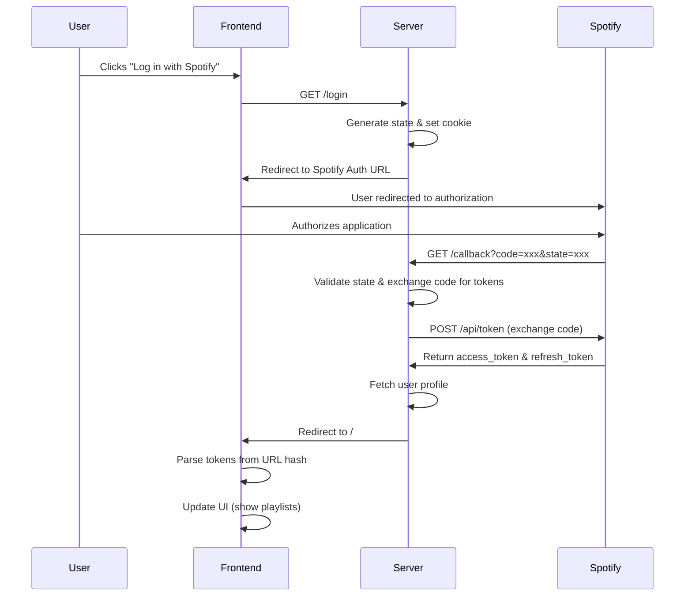

# Spotify Playlist Keyword Filter

A lot of unproductive words are in most of the current songs. If you want to have a clean playlist with none of such words, start using Spotify Playlist Keyword Filter. Maybe you have an addiction or little respect for women then listening to selected music can be benefiting.

Currently, the app is still in work.

## Features

- Connect to your Spotify account
- Fetch playlists and track information
- Search and retrieve song lyrics from Genius API
- Filter songs based on keyword content
- Clean playlist management
- Persistent lyrics caching with SQLite database
- Modular architecture with proper separation of concerns

## Architecture

The application has been refactored into a modular structure:

```
src/
├── app.js                 # Main application setup
├── config/               # Configuration management
│   ├── index.js         # Main config file
│   └── validation.js    # Environment validation
├── database/            # Database layer
│   ├── connection.js    # SQLite connection
│   ├── index.js        # Database initialization
│   └── models/         # Sequelize models
├── middleware/          # Express middleware
│   ├── auth.js         # Authentication middleware
│   ├── error-handler.js # Error handling
│   └── index.js        # Middleware setup
├── routes/             # Route handlers
│   ├── auth.js         # Authentication routes
│   ├── lyrics.js       # Lyrics API routes
│   ├── static.js       # Static file serving
│   └── index.js        # Route setup
├── services/           # Business logic
│   ├── lyrics.js       # Lyrics processing
│   └── spotify-auth.js # Spotify authentication
├── clients/            # External API clients
│   └── genius-api.js   # Genius API client
└── utils/              # Utility functions
  ├── cache-key-generator.js
  ├── crypto.js
  └── lyrics-extractor.js
```

## Prerequisites

- Node.js (Download from [nodejs.org](https://nodejs.org/download/))
- Spotify Developer Account
- Genius API Account

## Installation

1. Clone the repository
2. Install dependencies:

```bash
npm install
```

## Setup

### 1. Environment Variables

Copy the example environment file and configure your credentials:

```bash
cp .env.example .env
```

Update the `.env` file with your actual credentials:

```env
GENIUS_APP_URL="http://localhost:8888"
GENIUS_CLIENT_ID="your_genius_client_id_here"
GENIUS_CLIENT_SECRET="your_genius_client_secret_here"
GENIUS_CLIENT_ACCESS_TOKEN="your_genius_access_token_here"

SPOTIFY_CLIENT_ID="your_spotify_client_id_here"
SPOTIFY_CLIENT_SECRET="your_spotify_client_secret_here"
SPOTIFY_REDIRECT_URI="http://localhost:8888/callback/"

NODE_ENV="development"
```

### 2. Spotify API Credentials

1. Go to [Spotify for Developers Dashboard](https://developer.spotify.com/dashboard)
2. Create a new application
3. Set the Redirect URI to: `http://localhost:8888/callback/`
4. Note down your Client ID and Client Secret

### 3. Genius API Credentials

1. Go to [Genius API Documentation](https://docs.genius.com/)
2. Create an application to get your Client ID and Client Secret
3. Note down your credentials

## Running the Application

Start the development server:

```bash
npm start
```

The application will be available at `http://localhost:8888`

## API Endpoints

### Authentication

- `GET /login` - Initiate Spotify OAuth flow
- `GET /callback` - Handle Spotify OAuth callback
- `GET /refresh_token` - Refresh access token

### Lyrics

- `GET /api/lyrics/search?artist=<artist>&song=<song>` - Search for song lyrics
- `GET /api/lyrics/:songId` - Get lyrics for a specific song

The application uses SQLite for caching lyrics data. The database file (`lyrics_cache.sqlite`) is automatically created in the root directory on first run.

## Development

The codebase follows a modular architecture with clear separation of concerns:

- **Services**: Handle business logic and external API interactions
- **Routes**: Define API endpoints and request handling
- **Middleware**: Handle cross-cutting concerns like authentication and error handling
- **Models**: Define database schemas and operations
- **Clients**: Encapsulate external API communication
- **Utils**: Provide reusable utility functions

## Cache Management

The application includes intelligent caching to reduce API calls:

- Search results are cached for 24 hours
- Lyrics are permanently cached once fetched
- Cache keys are generated based on normalized artist and song names

## Error Handling

Comprehensive error handling is implemented throughout the application:

- Validation of environment variables on startup
- Graceful handling of API failures
- Detailed error logging
- User-friendly error responses

## Authentication Flow



**Flow Summary:**

- **Step 1-3**: Frontend → Server (`/login`)
- **Step 4-6**: Server → Spotify (authorization)
- **Step 7-10**: Spotify → Server (`/callback`)
- **Step 11-12**: Server → Frontend (with tokens)

The two redirect URLs serve different purposes:

- `SPOTIFY_REDIRECT_URI`: Where Spotify sends the user back to your server
- `APP_REDIRECT_URL`: Where your server sends the user back to your frontend

## Contributing

1. Fork the repository
2. Create a feature branch
3. Make your changes following the established architecture
4. Add tests if applicable
5. Submit a pull request

## License

CC BY-NC-SA 4.0 (Creative Commons Attribution-NonCommercial-ShareAlike 4.0)

## Author

Simon Waiblinger

## Repository

<https://github.com/simwai/spotify-playlist-keyword-filter>
