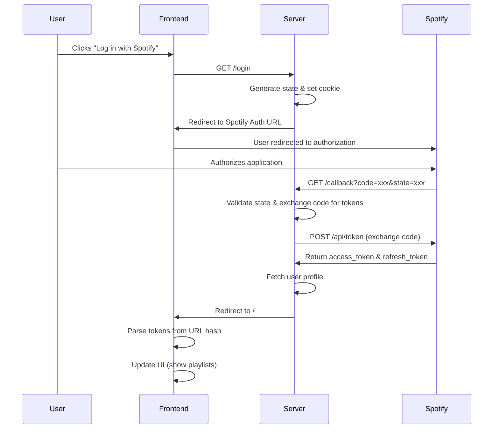

# Spotify Playlist Keyword Filter

A lot of unproductive words are in most of the current songs. If you want to have a clean playlist with none of such words, start using Spotify Playlist Keyword Filter. Maybe you have an addiction or little respect for women then listening to selected music can be benefiting.

## Features

- Connect to your Spotify account
- Fetch playlists and track information
- Search and retrieve song lyrics from Genius API
- Filter songs based on keyword content
- Clean playlist management
- Persistent lyrics caching with SQLite database
- Modular architecture with proper separation of concerns

## Prerequisites

- Node.js (Download from [nodejs.org](https://nodejs.org/download/))
- Spotify Developer Account
- Genius API Account

## Installation

1. Clone the repository
2. Install dependencies:

```bash
npm install
```

## Setup

### 1. Environment Variables

Copy the example environment file and configure your credentials:

```bash
cp .env.example .env
```

Update the `.env` file with your actual credentials.

### 2. Spotify API Credentials

1. Go to [Spotify for Developers Dashboard](https://developer.spotify.com/dashboard)
2. Create a new application
3. Set the Redirect URI to: `http://localhost:8888/callback/`
4. Note down your Client ID and Client Secret

### 3. Genius API Credentials

1. Go to [Genius API Documentation](https://docs.genius.com/)
2. Create an application to get your Client ID and Client Secret
3. Note down your credentials

## Running the Application

Start the development server:

```bash
npm dev
```

The application will be available at `http://localhost:8888`

## Development

The codebase follows a modular architecture with clear separation of concerns:

- **Services**: Handle business logic and external API interactions
- **Routes**: Define API endpoints and request handling
- **Middleware**: Handle cross-cutting concerns like authentication and error handling
- **Database**: Define database schemas and operations
- **Clients**: Encapsulate external API communication
- **Utils**: Provide reusable utility functions

## Cache Management

The application includes intelligent caching to reduce API calls:

- Lyrics are permanently cached once fetched

## Error Handling

Comprehensive error handling is implemented throughout the application:

- Validation of environment variables on startup
- Graceful handling of API failures
- Detailed error logging
- User-friendly error responses

## Authentication Flow



**Flow Summary:**

- **Step 1-3**: Frontend → Server (`/login`)
- **Step 4-6**: Server → Spotify (authorization)
- **Step 7-10**: Spotify → Server (`/callback`)
- **Step 11-12**: Server → Frontend (with tokens)

The two redirect URLs serve different purposes:

- `SPOTIFY_REDIRECT_URI`: Where Spotify sends the user back to your server
- `FRONTEND_URL`: Where your server sends the user back to your frontend


## Running With Docker

We recommend usind a Linux VM on Windows 

On Linux

1. Install Docker and Docker Compose

```bash

# Install prerequisites
sudo apt-get update
sudo apt-get install ca-certificates curl

# Add Docker's official repository and key
sudo install -m 0755 -d /etc/apt/keyrings
sudo curl -fsSL https://download.docker.com/linux/ubuntu/gpg -o /etc/apt/keyrings/docker.asc
sudo chmod a+r /etc/apt/keyrings/docker.asc
echo \
  "deb [arch=$(dpkg --print-architecture) signed-by=/etc/apt/keyrings/docker.asc] https://download.docker.com/linux/ubuntu \
  $(. /etc/os-release && echo "$VERSION_CODENAME") stable" | \
  sudo tee /etc/apt/sources.list.d/docker.list > /dev/null
sudo apt-get update

# Install Docker Engine and the Compose plugin
sudo apt-get install docker-ce docker-ce-cli containerd.io docker-buildx-plugin docker-compose-plugin

```

2. Run the Application
Clone the repository:

``` bash

git clone <repository_url>
cd <repository_name>
```
Set up your credentials:
```bash
cp .env.example .env
```

Now, edit the .env file with your Spotify and Genius API keys.

Launch the application:

```bash

docker compose up --build -d
```

Open your browser and go to http://localhost:8888.


## Contributing

1. Fork the repository
2. Create a feature branch
3. Make your changes following the established architecture
4. Add tests if applicable
5. Submit a pull request

## License

CC BY-NC-SA 4.0 (Creative Commons Attribution-NonCommercial-ShareAlike 4.0)

## Author

Simon Waiblinger

## Repository

<https://github.com/simwai/spotify-playlist-keyword-filter>
